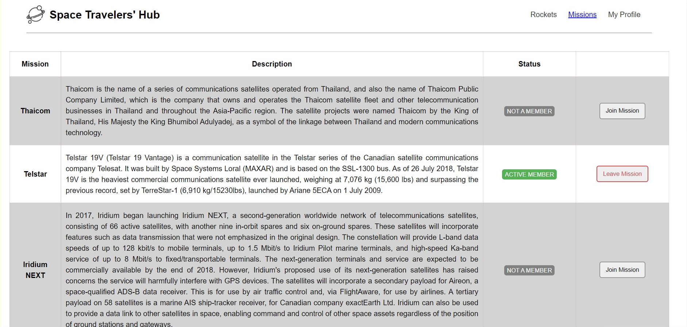
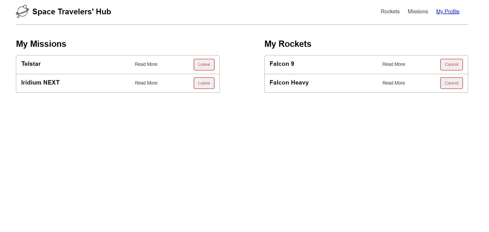

# Space Travelers' Hub
> Space Travelers' Hub is single-paged application (SPA) with 3 subpages, `Rockets`,`Missions` and `My Profile`. Data for rockets and missions pages was fetched from [rocket_API](https://api.spacexdata.com/v3/rockets) and [mission_API](https://api.spacexdata.com/v3/missions). This project allows user to do rocket reservation and cancellation. It also allows users to join and leave missions. These actions are reflected on My Profile page. Lastly, Kanban Board was used to collaborate for this project.

# Live Server

[Live Link](https://space-hub.netlify.app/)

# Screenshots
### Rockets Page

### Missions Page

### My Profile Page

# Getting Started

To get a local copy up and running follow these simple steps.

- You can clone this repo by typing `git clone git@github.com:DammyShittu/react-spacex.git` on your terminal.

- Type `cd react-spacex` to access the project on the terminal.
  
- Run `npm install` from your editor's terminal.

- Run `npm start` from your editor's terminal to run the app in the development mode.

- Run `npm run build` to build the app for production.
# Testing

- Run `npm test` to launch the test runner in the interactive watch mode

# Language Used:

This project was bootstrapped with [Create React App](https://github.com/facebook/create-react-app).

Redux

# Version Control System

GIT

# 👤 Authors

👤 Adedamola Shittu

GitHub: [@dammyShittu](https://github.com/DammyShittu/)

Twitter: [@aded_shittu](https://twitter.com/aded_shittu/)

LinkedIn: [Adedamola Shittu](linkedin.com/in/adedamola-shittu-3ab465172/)

👤 Faizan Zahid

GitHub: [@faizi2500](https://github.com/faizi2500)

Twitter: [@faizi_250](https://twitter.com/Faizy_250) 

LinkedIn: [@faizan2500](www.linkedin.com/in/faizan2500)

# 🤝 Contributing

Contributions, issues, and feature requests are welcome!

Feel free to check the [issues page](https://github.com/DammyShittu/react-spacex/issues).
Feel free to check the [Projects page](https://github.com/DammyShittu/react-spacex/projects).

# Show your support

Give a ⭐️ if you like this project!

# 📝 License

This project is [MIT](LICENSE) licensed.